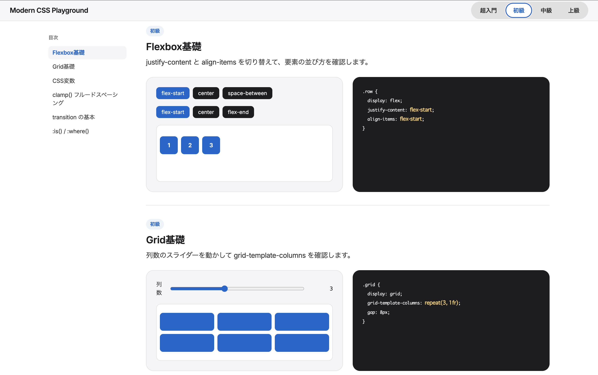

# Modern CSS Playground

> An interactive, single-file HTML/CSS/JS playground for learning modern CSS — from absolute basics to cutting-edge specs.

超入門・初級・中級・上級の4レベルに分けて、最近よく使われるモダンCSSの機能をインタラクティブに学べる学習ツールです。スライダーやボタンでデモを操作すると、対応するCSSコードがリアルタイムに変化して表示されます。

ビルド不要・外部ライブラリ不要の単一HTMLファイルで完結しているので、`index.html` をブラウザで開くだけで使えます。



## 使い方

```
open index.html
```

またはブラウザに `index.html` をドラッグ＆ドロップするだけで動きます。サーバーやビルドツールは不要です。

## 収録レベルと機能

### 超入門
HTMLとCSSを初めて触る方向けに、書き方の基本から始めます。

- HTMLとCSSの関係（インライン／`<style>`タグ／外部ファイル）
- セレクタの基本（要素・クラス・ID）
- ボックスモデル（margin / border / padding / content）
- 色の指定方法（キーワード / HEX / RGB）
- フォントとテキストの基本
- display の基本（block / inline / inline-block）

### 初級
レイアウトの基礎と、実用的なCSS機能を扱います。

- Flexbox基礎
- Grid基礎
- CSS変数（カスタムプロパティ）
- `clamp()` によるフルードスペーシング
- `transition` の基本
- `:is()` / `:where()` セレクタ

### 中級
実務でよく使う、少し発展的なCSS機能です。

- コンテナクエリ（Container Queries）
- `:has()` セレクタ
- ネストCSS（Nesting）
- `color-mix()`
- keyframes / transform アニメーション
- `aspect-ratio`

### 上級
最新のCSS仕様。対応ブラウザが限られる機能も含みます。

- スクロール駆動アニメーション（Scroll-driven Animations）
- View Transitions API
- `@layer`（カスケードレイヤー）
- Subgrid
- CSS Anchor Positioning
- `@property`

## 特徴

- **ビジュアルデモ＋リアルタイムコード表示**：操作した内容がどのCSSに対応しているかが一目で分かります。
- **単一HTMLファイル**：ビルドツール・外部ライブラリなしで完結（Google Fontsのみ利用）。
- **レスポンシブ対応**：スマホからデスクトップまで、レイアウトが崩れないよう調整済みです。

## 技術構成

Vanilla HTML / CSS / JavaScript のみ。フレームワークやパッケージマネージャーは使用していません。

## License

[MIT](LICENSE)
